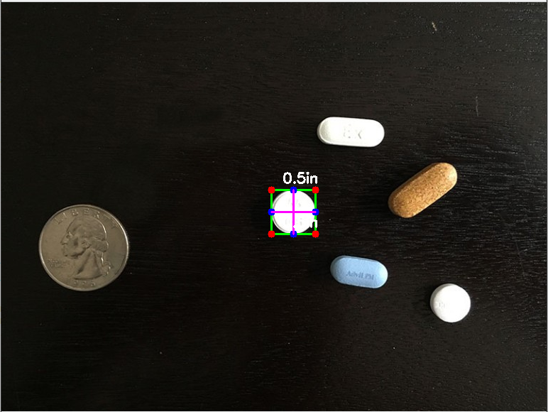
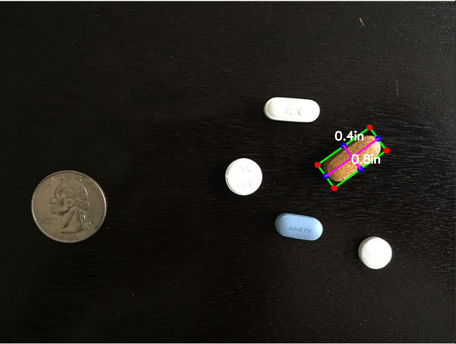
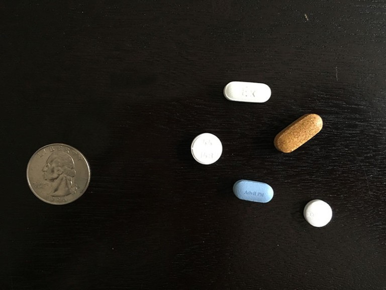

# Measuring-size-of-objects-in-an-image
Measuring small objects size with respect to a reference(like a coin)
## API's and Libraries
- Opencv
- Imutils
- Scipy
## How To Use
- Clone/Download
- Take a photo with reference object differentiated from others
- Give the width of the reference object in line 4
- Place the photo in same directory as the .ipbny file
- In cell 3 prodive the image name
- Run all cells then you will get something like this

Final Image                |  Final Image
:-------------------------:|:-------------------------:
       |  

- For source like this

## Info
- Read Image,Preprocess,Find Contours
- Define width of Reference object¶
- Loop Through Contours
- Find MinRectangle
- Draw Line along rectangles
- Calculate width and height based on reference(PixelPerMetric)
